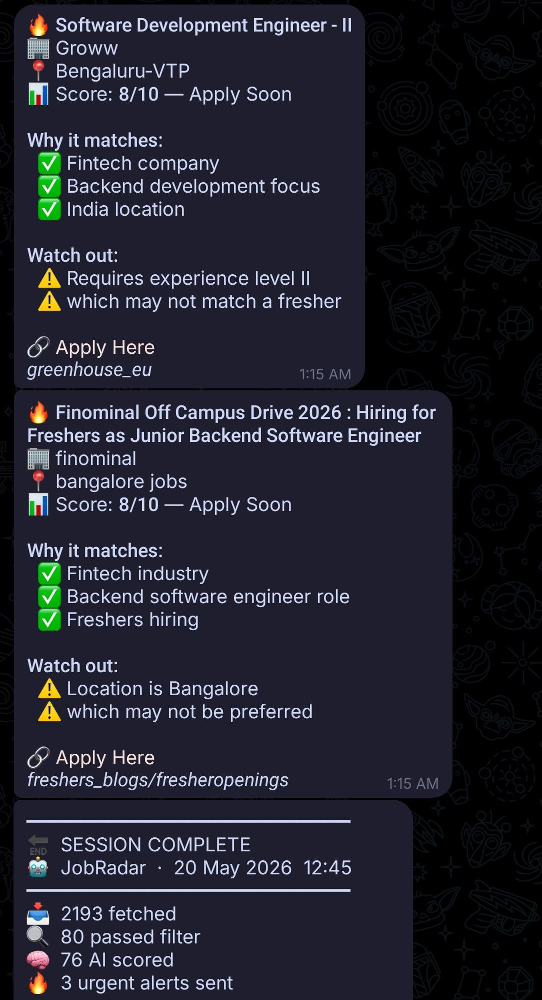

<div align="center">
  
  <h1>JobRadar</h1>
  <p><strong>Your personal job-hunting agent — filters the noise, scores with AI, and delivers the best jobs straight to your Telegram.</strong></p>
</div>

<p align="center">
  <a href="https://python.org"></a>
  <a href="LICENSE"></a>
  <a href="#-16-job-sources"></a>
  <a href="#-performance--api-usage"></a>
  <a href="docs/setup_guide.md"></a>
</p>

---

JobRadar aggregates **16 job sources**, eliminates noise with zero-cost rule-based filters, deduplicates across runs, ranks by relevance, scores with AI, and delivers priority alerts straight to **Telegram** — twice daily, entirely on free-tier APIs.

Built for freshers, interns, and early-career developers. But **fully configurable for any role, stack, domain, or location via `profile.yaml` alone** — no code changes needed whether you're a cybersecurity candidate, a data engineer, or a mobile developer.

> [!TIP]
> **New here?** Read [`docs/setup_guide.md`](docs/setup_guide.md) first — it walks you through getting everything running from scratch.

---

## Table of Contents

- [How It Works](#-how-it-works)
- [Features](#-features)
  - [16 Job Sources](#-16-job-sources)
  - [Smart Pre-Filter](#️-smart-pre-filter)
  - [Heuristic Relevance Ranker](#-heuristic-relevance-ranker)
  - [AI Scorer](#-ai-scorer)
  - [Multi-Key Deduplication](#-multi-key-deduplication)
- [Project Structure](#️-project-structure)
- [Quick Start](#-quick-start)
- [Automation](#-automation)
- [Performance & API Usage](#-performance--api-usage)
- [Maintenance & Tuning](#️-maintenance--tuning)
- [Future Goals](#-future-goals)
- [Contributing](#-contributing)
- [License](#-license)

---

## 🔄 How It Works

<table>
<tr>
<td valign="top" width="260">

**What lands in your Telegram:**



Urgent alerts fire the moment a high-scoring job is found. Every run ends with a session summary card.

</td>
<td valign="top">

```
┌─────────────────────────────────────────────────┐
│         16 Job Sources (Concurrent)             │
│  ATS APIs · Workday · YC · hackernews · Naukri  │
│  hiringcafe · Blogs RSS · Serper · HN · More    │
└────────────────────────┬────────────────────────┘
                         │ ~8,000–9,000 raw jobs
                         ▼
┌─────────────────────────────────────────────────┐
│           Multi-Key Deduplication               │
│  Title+Company+Location MD5 · Canonical URL MD5 │
│  Run-level + SQLite persistent — never repeat   │
└────────────────────────┬────────────────────────┘
                         │ ~600–800 new jobs
                         ▼
┌─────────────────────────────────────────────────┐
│         Smart Rule-Based Pre-Filter             │
│  Expiry · Blacklists · ATS Allowlist · Location │
│  RSS Tags · Experience · Company Cap            │
│        Drops ~90–95% with zero AI cost          │
└────────────────────────┬────────────────────────┘
                         │ ~50–150 eligible jobs
                         ▼
┌─────────────────────────────────────────────────┐
│         Heuristic Relevance Ranking             │
│  Go/TS stack · Fintech · Fresher · Recency      │
│       Best-fit jobs scored first, free          │
└────────────────────────┬────────────────────────┘
                         │ ranked, best-first
                         ▼
┌─────────────────────────────────────────────────┐
│     AI Scorer — Gemini 2.5 Flash                │
│  Native JSON mode · 4.5s throttle (~13 RPM)    │
│  130 jobs/run · few-shot calibrated 1–10 scale │
└────────────────────────┬────────────────────────┘
                         │
         ┌───────────────┴───────────────┐
         ▼                               ▼
 Score ≥ 8 (Urgent)            Score 6–7 (Digest)
 Instant Telegram push         Session summary card
```

</td>
</tr>
</table>

---

## ✨ Features

### 🔌 16 Job Sources

**Structured ATS APIs** — direct structured API polling of 10 platforms, no scraping, no JS rendering:

| Platform | Example Companies | Notes |
|---|---|---|
| **Greenhouse US** | Razorpay, PhonePe, Stripe, GitLab, Cloudflare, MongoDB | `?content=true` returns full JD in one call |
| **Greenhouse EU** | Groww | European instance, separate endpoint |
| **Lever** | Meesho, CRED, Paytm, Spotify, Binance | Full JD + lists in a single response |
| **Ashby** | Navi, Linear, Notion, Supabase, Railway | `descriptionPlain` pre-stripped |
| **Workable** | Juspay, Gridlines, Apna | Secondary detail call for full JD |
| **SmartRecruiters** | Upstox, Freshworks, Canva, Cars24, ixigo | Structured per-section JD |
| **Rippling** | Axio, Multiplier, Dub | Job UUID detail endpoint |
| **BambooHR** | Urban Company, Shadowfax, Google, Meta | Subdomain-based URLs |
| **Recruitee** | Unstop, Salesforce, IBM | Inline HTML description in list response |
| **Personio** | Open Financial, Amazon, Basecamp | Public XML feed, no auth |
| **Workday** | Adobe, Samsung, BrowserStack, Cisco, Sprinklr | POST-based API with lazy JD fetch; requires pre-discovered tenant/server/site |

All companies are listed in `companies.yaml`. Per-company caps prevent any single large company from dominating the scoring budget.

**Additional sources:**

| Source | Description |
|---|---|
| **Naukri.com** | India's largest job board. 10 keywords × 3 locations × 2 pages = up to 1,200 raw cards per run; Stage-1 filters applied inline |
| **Hirist.tech** | India-specific niche tech board targeting backend, Go, Python, and TypeScript roles |
| **Y Combinator Jobs** | Two-phase scraper (card listing → full JD). High-signal for early-stage startups globally |
| **Internshala** | India's #1 internship platform. Optimised plain-HTTP parser — bypasses browser overhead entirely |
| **Fresher Blogs RSS** | 8+ Indian fresher blogs via concurrent `ThreadPoolExecutor`. Lazy JD fetch — full pages fetched only after a job survives prefilter |
| **Serper.dev** | Tiered Google dork discovery focused exclusively on what ATS APIs can't find: custom `/careers` pages, hidden applications (Forms, Notion), India-specific ATS |
| **HackerNews "Who is Hiring?"** | Parses monthly HN thread via Algolia API. Self-healing auto-discovery — no manual thread ID updates ever needed |
| **Reddit Job Feeds** | r/cscareerquestions, r/IndiaJobs, and related subreddits via RSS |
| **Jobicy / RemoteOK** | Remote jobs JSON APIs. Good for catching remote-first companies open to India timezone candidates |
| **hiring.cafe** | Aggregated ATS jobs via internal Next.js API. Rich structured data — server-side filtered by seniority, department, location. ~50 high-signal jobs per run |

---

### 🛡️ Smart Pre-Filter

Drops **~90–95%** of listings before any AI call — each check is pure Python, zero network cost:

| Check | What it catches |
|---|---|
| **Age filter** | Jobs older than `max_job_age_days` (default 45 days). Handles ISO dates, RFC dates, relative strings, and Unix epoch |
| **Expiry signals** | Title/description regex for "application closed", "position filled", "last date: [past date]", etc. |
| **ATS title allowlist** | ATS titles must contain a recognised tech signal (engineer, backend, golang, intern, etc.) |
| **ATS location filter** | Instantly rejects US/UK/EU structured location fields; passes India/Remote/ambiguous |
| **RSS tag filter** | Zero-cost intersection check on experience, batch, and location tags from RSS metadata — no page fetches needed |
| **Experience keyword scan** | Hard rejects descriptions containing "2+ years", "senior engineer", "tech lead", etc. |
| **Location description scan** | Rejects jobs explicitly requiring on-site in non-India geographies |
| **Company/role blacklists** | Configurable lists in `profile.yaml` |
| **ATS company cap** | Max N jobs per company per run (default 25) — prevents GitLab/Stripe dominating the pool |

---

### 🏆 Heuristic Relevance Ranker

Before any AI call, every eligible job gets a fast Python relevance score that determines the order in which jobs enter the AI scorer — so the token budget is spent on the strongest matches first.

**Fully profile-driven** — all detection patterns (skills, domains, project signals, synergy combos) are compiled dynamically from `profile.yaml` at runtime. A cybersecurity candidate who updates their skills and industries gets correct ranking immediately, with no code changes.

**Three scoring layers:**

| Layer | What it does |
|---|---|
| **Layer 1 — Positive bonuses** | Primary skill in title (+5), secondary skill (+3/+1), backend/API (+2), fresher role (+2), high-priority domain (+3), project signals (+2 each), recency (+4/+2/+1) |
| **Layer 2 — Penalties + synergies** | No skill match (−3), generic title (−2), bodyshop company (−1), ATS stub desc (−2); synergy bonuses for primary-skill+domain (+3) and primary-skill+project (+2) |
| **Layer 3 — Source offsets** | Internshala with stipend ≥ ₹10k (+2), fresher blog batch tag match (+1), Naukri stub desc (−1), Serper dork result (−1) |

> [!NOTE]
> Jobs with no `posted_at` date are **not penalised** — they compete on skill/role signals alone. This avoids silently dropping good jobs that don't expose a date (common with Naukri and some ATS endpoints).

All numeric weights are configurable in `profile.yaml → ranker_weights:` without touching code.

---

### 🤖 AI Scorer

**Model**: `gemini-2.5-flash` via Google Gemini free tier (Google AI Studio).

**Rate limiting:**

| Layer | Mechanism | Value |
|---|---|---|
| Per-minute (RPM) | `REQ_INTERVAL` throttle | 4.5s gap → ~13.3 req/min (under ~15 RPM limit) |
| TPM | Effectively none | Gemini free tier: ~1,000,000 TPM — no bottleneck |
| Daily ceiling | `max_ai_jobs_per_run` | 130 jobs max (all scored — no token budget gate needed) |

**Key features:**
- **5-point few-shot calibration** — score anchors at 9, 7, 6, 5, and 3 anchor the full useful decision range
- **Mandatory score reasons** — ALL scores (including <6) include a 1-2 sentence reason for debugging
- **Native JSON mode** via `response_mime_type="application/json"` — guaranteed JSON, no markdown fence stripping
- **Pre-Gemini expiry scan** — scans the full description for closure signals before making any AI call
- **6,000 char JD limit** — double the old Groq limit (3,000 chars); better context for long JDs

**Score buckets:**

| Score | Action |
|---|---|
| **8–10** | Urgent — instant Telegram push notification |
| **6–7** | Digest — included in session summary card |
| **5** | Persisted to DB, not notified |
| **< 5** | Dropped |

---

### 🔗 Multi-Key Deduplication

Never see the same job twice across sources or runs:

- **Hash 1 — Normalised Title+Company+Location MD5** — collapses `Pvt Ltd` / `Private Limited` / `Inc.`, city aliases (`Bengaluru → bangalore`), year noise in titles, and whitespace
- **Hash 2 — Canonical URL MD5** — strips `utm_*`, `ref`, `source`, and other tracking parameters
- **Run-level** — in-memory dedup within the current run (same job from multiple sources)
- **Persistent** — SQLite lookup against all previously seen jobs

---

## 🗂️ Project Structure

```
jobradar/
│
├── main.py                    # Entry point — orchestrates the full pipeline
│
├── profile.yaml               # ← YOUR MAIN CONFIG FILE (roles, skills, location, filters)
├── companies.yaml             # ATS company slugs across 9 platforms
│
├── sources/                   # Job fetchers — one file per source
│   ├── ats.py                 # 9-platform ATS polling (Greenhouse, Lever, Ashby, etc.)
│   ├── workday.py             # Workday ATS — POST-based API with lazy JD fetch
│   ├── naukri.py              # Naukri.com — Stage-1 filtered search
│   ├── hirist.py              # Hirist.tech — India niche tech board
│   ├── yc.py                  # YC jobs board — two-phase scraper
│   ├── internshala.py         # Internshala — optimised plain-HTTP scraper
│   ├── freshers_blogs.py      # 8+ Indian fresher blogs — concurrent RSS + lazy JD fetch
│   ├── serper.py              # Tiered Google dork discovery
│   ├── hackernews.py          # HN "Who is Hiring?" — Algolia auto-discovery
│   ├── reddit.py              # Reddit RSS feeds
│   ├── jobicy.py              # Jobicy.com — remote jobs JSON API
│   ├── remoteok.py            # RemoteOK — JSON API
│   ├── hiringcafe.py          # hiring.cafe — Next.js API, entry-level filtered
│   ├── cutshort.py            # Cutshort.io API (currently disabled)
│   ├── instahyre.py           # Instahyre API + scraper fallback (currently disabled)
│   └── wellfound.py           # Wellfound/AngelList (currently disabled — blocks bots)
│
├── pipeline/                  # Processing stages
│   ├── dedup.py               # Run-level + persistent SQLite dual-hash deduplication
│   ├── prefilter.py           # Multi-layer rule-based hard filters (zero AI cost)
│   ├── ranker.py              # Heuristic relevance ranker — sorts jobs before AI scoring
│   └── scorer.py              # Gemini AI scorer — native JSON mode, few-shot calibrated, no token budget gate
│
├── notify/
│   └── telegram_bot.py        # Urgent push alerts + session digest card
│
├── storage/
│   └── db.py                  # SQLite schema + dual-hash CRUD helpers
│
├── data/                      # Auto-created at runtime
│   ├── <profile>.db           # Per-user SQLite database
│   └── <profile>.log          # Rotating run logs (1MB × 3 files)
│
├── docs/
│   ├── setup_guide.md         # Complete setup & customisation guide
│   └── telegram_ss.jpg        # Example Telegram alert screenshot
│
├── requirements.txt
└── .env                       # API keys (never commit)
```

---

## 🚀 Quick Start

> [!NOTE]
> The steps below are a condensed quick-start. For the full walkthrough — API keys, `profile.yaml` field reference, Naukri config, ranker weights, and troubleshooting — see **[`docs/setup_guide.md`](docs/setup_guide.md)**.

### 1. Clone & Install

```bash
git clone https://github.com/your-username/jobradar.git
cd jobradar
python3 -m venv venv && source venv/bin/activate
pip install -r requirements.txt
```

### 2. Configure `.env`

```env
GEMINI_API_KEY=AIzaSy_xxxxxxxxxxxxxxxxxxxxxxxx
SERPER_API_KEY=xxxxxxxxxxxxxxxxxxxxxxxx
TELEGRAM_BOT_TOKEN=1234567890:AAxxxxxxxxxxxxxxxx
TELEGRAM_CHAT_ID=987654321
```

### 3. Configure `profile.yaml`

Edit to match your skills, target roles, locations, and hard-reject rules:

```yaml
candidate:
  name: "Your Name"
  roles:
    primary:
      - "Backend Engineering Intern"
      - "Go Developer Intern"
  skills:
    strong: ["Go", "TypeScript", "PostgreSQL", "Redis", "Docker"]
    learning: ["Kubernetes", "AWS"]
  location:
    base: "Kolkata, India"
    acceptable: ["Remote", "Bangalore", "Mumbai"]
    hard_reject: ["US only", "UK only", "Europe only"]

hard_reject:
  max_job_age_days: 45
  experience_keywords:
    - "2+ years"
    - "senior engineer"
    - "tech lead"
```

Full field reference → [`docs/setup_guide.md`](docs/setup_guide.md)

### 4. Validate (Dry Run)

```bash
python main.py profile.yaml --dry-run
```

Prints your full config summary and confirms the DB initialises correctly — no API calls made.

### 5. Run

```bash
python main.py
```

---

## ⏰ Automation

### Option A — Linux Cron (WSL / EC2)

```bash
# Run at 8 AM and 6 PM daily
0 8,18 * * * cd /path/to/jobradar && ./run.sh >> data/cron.log 2>&1
```

### Option B — Windows Task Scheduler

```powershell
$action  = New-ScheduledTaskAction -Execute "wsl" -Argument "-d archlinux -- bash /home/user/jobradar/run.sh"
$trigger = New-ScheduledTaskTrigger -Daily -At "8:00AM"
Register-ScheduledTask -TaskName "JobRadar" -Action $action -Trigger $trigger -RunLevel Highest
```

---

## 📊 Performance & API Usage

### Typical Run Stats

| Stage | Count | Time | Notes |
|:---|:---|:---|:---|
| **Raw jobs fetched** | ~8,000–9,000 | ~9–11 min | ATS polling is the bottleneck; Naukri Stage-1 alone scans 1,200 listings |
| **After deduplication** | ~600–800 new | < 1 sec | Fast dual-hash SQLite lookups |
| **After pre-filter** | ~100–150 eligible | < 1 sec | Rule-based, zero AI cost |
| **After heuristic ranking** | same count, sorted | < 1 sec | Pure Python, no network |
| **After AI scorer** | up to 130 scored | ~10 min | 4.5s/request, 130 job cap, no token budget gate |
| **Alerts delivered** | 2–6 urgent | < 1 sec | Telegram push for score ≥ 8 |
| **Total pipeline** | | **~20–22 min** | |

### Free-Tier API Usage

| API | Usage per run | Free tier | Headroom |
|:---|:---|:---|:---|
| **Gemini (2.5-flash)** | ~455K tokens | ~1.5M tokens/day | 3+ runs/day with room to spare |
| **Serper.dev** | 25 queries | 2,500 queries/month | 1,500/month = 60% of free tier |
| **Telegram Bot** | ~10–15 messages | Unlimited | Free |

**Gemini rate limits** (2.5-flash free tier, approximate — project-level, verify in AI Studio):
- **RPM**: ~10–15 requests/min → `REQ_INTERVAL = 4.5s` gives ~13.3 RPM (safe headroom)
- **TPM**: ~1,000,000 tokens/min → no TPM bottleneck (13 req/min × 3,500 tok = 45,500 TPM ≪ 1M limit)
- **TPD**: ~1,500,000 tokens/day → 130 jobs × 3,500 tok = 455K tokens/run, well within limit

---

## 🛠️ Maintenance & Tuning

**Adding ATS companies** — add the slug to the correct section in `companies.yaml`. Verify the endpoint first:

```bash
# Greenhouse
curl -s "https://boards.greenhouse.io/v1/boards/SLUG/jobs" | python -m json.tool | head -5
# Lever
curl -s "https://api.lever.co/v0/postings/SLUG" | python -m json.tool | head -5
# SmartRecruiters
curl -s "https://api.smartrecruiters.com/v1/companies/SLUG/postings" | python -m json.tool | head -5
# Workday (POST-based — requires tenant, wd_server, site)
curl -s -X POST "https://TENANT.WDSERVER.myworkdayjobs.com/wday/cxs/TENANT/SITE/jobs" \
  -H "Content-Type: application/json" -H "Accept: application/json" \
  -H "Origin: https://TENANT.WDSERVER.myworkdayjobs.com" \
  -d '{"appliedFacets":{},"limit":3,"offset":0,"searchText":""}' | python -m json.tool | head -10
```

**Tuning the pre-filter** — adjust `hard_reject.experience_keywords` and `hard_reject.role_blacklist` in `profile.yaml` if too many irrelevant jobs slip through.

**Tuning the ranker** — edit numeric weights in `profile.yaml → ranker_weights:`. All bonus/penalty/threshold values are configurable without touching code. Skill, domain, and project detection patterns rebuild automatically from your profile each run.

**Switching domains** (e.g. cybersecurity, data engineering) — update `candidate.skills`, `candidate.industries`, and `candidate.projects.relevance_signal` in `profile.yaml`. The ranker, prefilter, and AI scorer all adapt — no code changes needed.

**Naukri coverage** — add more keywords or locations under `profile.yaml → naukri:`. Each keyword × location combo = 2 pages × up to 20 listings each.

**Serper budget** — `MAX_SERPER_CALLS` (default 25) and `TIER_1_BUDGET` (default 10) in `sources/serper.py`. Tier 1 budget ensures the unique sources always run regardless of total cap.

**Per-user profiles** — run `python main.py my_profile.yaml` to use a different profile file. Each profile gets its own DB and log file under `data/`.

---

## 🔭 Future Goals

1. **Multi-profile / loosely-coupled architecture** — move to a `profiles/` directory where each `.yaml` is a fully self-contained config. A single codebase serving multiple people simultaneously on a hosted instance.

2. **Fix disabled sources** — Wellfound, Instahyre, and Cutshort are currently disabled due to bot blocking or API instability. The goal is to handle these properly via headless browser or reverse-engineered API calls.

3. **Application tracking UI + weekly insights** — a lightweight web UI for tracking applications and a personal hiring dashboard: which companies are actively hiring for your stack, which sources yield the highest-scoring jobs, where the best opportunities are concentrated.

4. **Global-first design** — the current source mix skews heavily toward India. The goal is to make India-specific sources opt-in rather than default, and expand global coverage so the tool is equally useful anywhere.

5. **Public hosting** — if the above pieces come together, host it as a public service. Users onboard their own profile, connect their Telegram, and get alerts without running any code themselves.

---

## 🤝 Contributing

Contributions are welcome. The most impactful thing you can add right now is a **new job source**.

See **[CONTRIBUTING.md](CONTRIBUTING.md)** for the full guide — it covers the `Job` dataclass contract, how to wire a new source into the pipeline, lazy-fetch patterns, error handling expectations, and the PR process.

> [!NOTE]
> When adding a new source, please include a brief description of what the source provides and why it's a good fit for the pipeline (unique coverage, not duplicating existing ATS APIs, etc.).

---

## 📄 License

Distributed under the [MIT License](LICENSE).
